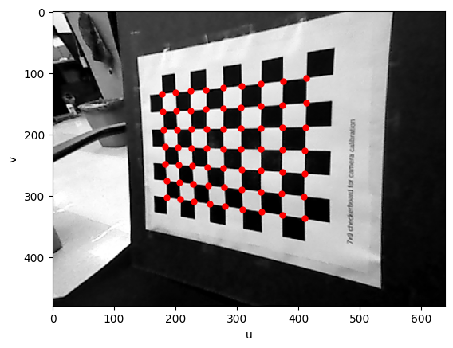
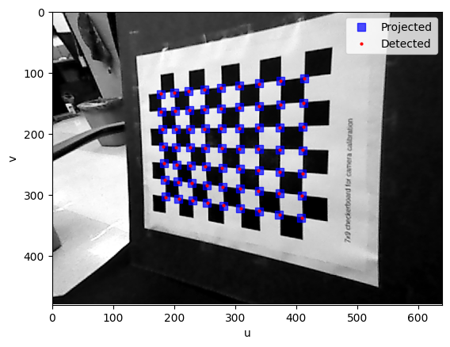
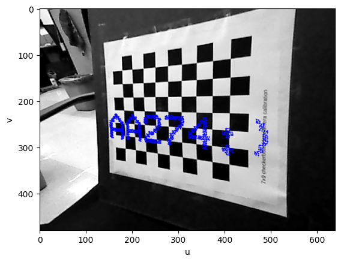

# Principles of Robot Autonomy I HW3
Homework 3 code for Principles of Robot Autonomy I

## Problem 1: Chessboard Camera Extrinsics 

### Goal
Compute the position and orientation (pose) of a camera relative to a known marker arrangement (in this example, the corners of the checkerboard), or equivalently the pose of the chessboard in the camera's coordinate frame. 

We're given the camera intrinsics matrix K (hardcoded to describe how 3D rays map to image pixels) and the physical geometry of the board (the distance between each corner, `SQUARE_SIZE = 0.0205` meters).

### What We Generate

**Problem 1.1: Corner Detection**
- Uses OpenCV's `cv2.findChessboardCorners()` to detect 63 corner points (9×7 grid) in the checkerboard image
- Extracts pixel coordinates (u, v) for each detected corner
- Visualizes the detected corners on the image


**Problem 1.2: Homography and Camera Pose Estimation**
- **Homography H**: Computes a 3×3 homography matrix H that maps world coordinates on the checkerboard plane (Z=0) to image pixel coordinates. Since the chessboard lies on a flat plane, we can represent 3D world points as 2D coordinates and use homography to map these world coordinates into 2D image coordinates. However, we would acquire depth information from the real world using lidar or other ToF sensors or stereo sensors.
- **Camera Pose (R, t)**: Decomposes the homography to extract the camera's rotation matrix R (3×3) and translation vector t (3×1) that describe how to transform points from the chessboard's world coordinate system into the camera's coordinate system:
```
P_camera = R @ P_world + t
```

The decomposition process:
1. Removes camera internal effects by computing `K_inv @ H`
2. Normalizes to extract rotation vectors r0, r1 (first two columns)
3. Computes r2 as the cross product of r0 and r1 to ensure orthogonality
4. Extracts translation t from the third column

**Problem 1.3: Validation and Projection Function**
- **`transform_world_to_camera()` function**: Implements the complete transformation pipeline:
  - Transforms 3D world coordinates to camera coordinates using R and t
  - Projects to image plane using camera intrinsics K
  - Normalizes homogeneous coordinates to get pixel coordinates (u, v)
- **Validation**: Projects the known world coordinates of the checkerboard corners back onto the image and compares them with the originally detected corners
- Visualizes both detected corners (red) and projected corners (blue/green) to verify calibration accuracy


### What It Shows and Why It Matters

**Validation**: When we project the world coordinates of checkerboard corners using our computed camera pose (R, t) and intrinsics (K), the projected points should align with the originally detected corners. This confirms that:
- The homography H was correctly computed
- The camera pose (R, t) was correctly extracted from H  
- The transformation pipeline works correctly

The computed R and t fully describe the camera's pose in 3D space: **R** tells us how the camera is oriented (rotation), and **t** tells us where it's positioned (translation) relative to the checkerboard.

**Why 3D↔2D Transformation is Critical**: Cameras lose depth information when capturing 3D scenes as 2D images. The calibration process uses **2D→3D correspondences** (2D image points + known 3D world points) to solve for the camera pose. Once calibrated, we can perform both directions:

- **3D→2D (Projection)**: Projecting known 3D world points onto the image plane (as we do in validation)
- **2D→3D (Back-projection)**: Converting 2D image points back to 3D world coordinates when depth information is available (from LiDAR, stereo cameras, or ToF sensors)

By knowing the camera's pose (R, t) and intrinsics (K), we have a complete mathematical model that bridges the 3D world and 2D images. This enables:

- **Robot Navigation & Manipulation**: Localizing robots relative to landmarks (2D→3D), enabling precise manipulation by converting 2D image coordinates to 3D world coordinates
- **Augmented Reality**: Overlaying virtual objects on real scenes (3D→2D) with correct perspective and scale
- **Autonomous Systems**: Self-driving cars understanding 3D road geometry and object positions from 2D images (2D→3D)
- **3D Reconstruction**: Creating 3D models from multiple calibrated camera viewpoints using triangulation (2D→3D)

This bidirectional transformation enables robots and computers to reason about the 3D world using only 2D images—algorithmically performing what human vision does naturally.



## Problem 2: Linear Filtering

### Goal: 
Wrote correlate image function which ran horizontal and vertical edge detection filter and generated resulting images.

## Dependencies
Python package dependencies for this assignment are listed in the `requirements.txt` file and can be automatically installed by...
```
pip install -r requirements.txt
```
Please note the additional dependence on opencv for this assignment.